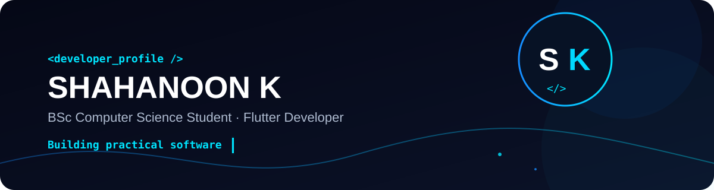

<p align="center">
  
</p>

<p align="center">
  
</p>

<h2 align="center">👋 Hello, I'm Shahanoon K</h2>

<p align="center">
  <strong>BSc Computer Science Student · Flutter Developer</strong>
</p>

<p align="center">
  Building practical software with Flutter, Dart, Firebase, web technologies, and AI.
</p>

<p align="center">
  <a href="https://github.com/dev-Shahanoon">
    GitHub
  </a>
  ·
  <a href="https://www.linkedin.com/in/shahanoon-k">
    LinkedIn
  </a>
  ·
  <a href="https://shahanoon-protfolio.vercel.app">
    Portfolio
  </a>
</p>

---

## 👨‍💻 About Me

I'm a **BSc Computer Science student and Flutter developer** interested in building practical applications and learning modern software technologies.

- 🎓 BSc Computer Science student
- 📱 Flutter & Dart developer
- 🌐 Interested in web development
- 🔥 Experience with Firebase & Cloud Firestore
- 🤖 Exploring AI-powered applications
- 🧩 Interested in backend and API integration
- 🛠️ Learning by building real-world projects

---

## 🚀 Featured Projects

### 🌱 FreshTrack

**Smart Food Inventory & Expiry Tracking App**

A Flutter application designed to help users manage food inventory, monitor expiry dates, receive alerts, scan products, view analytics, and discover AI-powered recipe ideas.

**Tech Stack**

`Flutter` `Dart` `Firebase` `Firestore` `Gemini AI`

**Features**

- Food inventory management
- Expiry tracking
- Expiry alerts
- Product scanning
- Analytics
- Firebase authentication
- AI-powered recipe assistance

[View Repository →](https://github.com/dev-Shahanoon/FreshTrack)

---

### 💰 Expense Tracker

**Personal Finance & Expense Management App**

A completed Flutter application for managing personal finances across multiple accounts.

**Features**

- Multiple bank/account management
- Income and expense tracking
- Account-wise transactions
- Transaction history
- Account balance tracking
- Expense categories
- Monthly analytics
- Dark theme

**Tech Stack**

`Flutter` `Dart` `Local Database`

> Repository will be added soon.

---

### 💻 CodeStep

**Interactive Coding Practice Application**

A learning-focused application designed to help users learn programming through hands-on exercises and coding challenges.

**Current Learning Areas**

- Python
- HTML
- Programming fundamentals
- Interactive coding exercises

**Tech Stack**

`Flutter` `Dart` `Python` `FastAPI`

> 🚧 Currently under active development.

---

### 🌐 Shahanoon K — Portfolio

My personal developer portfolio showcasing my projects, skills, education, experience, and development journey.

**Tech Stack**

`React` `Vite` `JavaScript` `CSS`

[View Repository →](https://github.com/dev-Shahanoon/shahanoon-protfolio)

[Visit Portfolio →](https://shahanoon-protfolio.vercel.app)

---

## 🛠️ Tech Stack

### Languages

<p>
  <code>Dart</code>
  <code>Python</code>
  <code>JavaScript</code>
  <code>HTML</code>
  <code>CSS</code>
</p>

### Frameworks & Platforms

<p>
  <code>Flutter</code>
  <code>React</code>
  <code>Vite</code>
  <code>FastAPI</code>
</p>

### Backend & Cloud

<p>
  <code>Firebase</code>
  <code>Cloud Firestore</code>
  <code>REST APIs</code>
</p>

### Tools

<p>
  <code>Git</code>
  <code>GitHub</code>
  <code>VS Code</code>
  <code>Android Studio</code>
</p>

---

## 🔭 Currently Building

### CodeStep

An interactive coding practice platform focused on learning through hands-on exercises.

```text
Flutter
   ↓
Python
   ↓
HTML
   ↓
FastAPI
   ↓
Interactive Coding Practice
